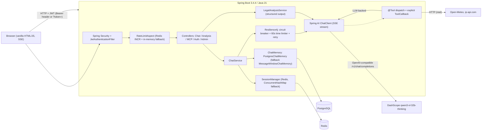

# AgentSaul — Architecture

This document describes what the code does and how it is organized. Everything
here is verifiable in `src/main/java/com/agentsaul/`.

## 1. Overview

AgentSaul is a **single-turn function-calling chat agent** built with Spring AI. The
theme is a "Saul Goodman" legal assistant, but the point of the project is the
**Spring AI** plumbing underneath: SSE streaming, `@Tool` function calling, explicit
`ToolCallback` registration, structured output, and session-scoped memory.

It is **not** an autonomous agent. There is no multi-step planning loop, no
reflection, and no tool-use reasoning beyond what Spring AI's `ChatClient` does in a
single LLM round trip. When the model decides a tool is needed, it emits one tool
call (or a batch), the tool runs, the result is fed back, and the model produces a
final answer. That is the whole loop.

| | |
|---|---|
| Language / runtime | Java 21 |
| Framework | Spring Boot 3.4.4 |
| AI | Spring AI 1.0.0 |
| LLM | DashScope `qwen3-vl-32b-thinking` via an OpenAI-compatible base URL |
| Database | PostgreSQL (MyBatis) |
| Cache / session | Redis (Spring Session + Redis cache) |
| Resilience | Resilience4j (circuit breaker / time limiter / retry) |
| Auth | JWT (stateless) + optional API key |
| Observability | Micrometer/Prometheus + OpenTelemetry + structured JSON logging |
| Deployment | Docker, docker-compose, k8s manifests, GitHub Actions |

## 2. System context



## 3. Components

### 3.1 Web layer

| Controller | Path | Notes |
|---|---|---|
| `ChatController` | `/api/chat`, `/api/session`, `/api/conversations/**` | SSE streaming chat, conversation CRUD, markdown export |
| `LegalAnalysisController` | `/api/analysis/legal` | Structured output — LLM JSON mapped to a Java record |
| `McpDemoController` | `/api/mcp/**` | Tool listing + a chat endpoint that uses the same `@Tool`-annotated methods |
| `AuthController` | `/api/auth/login`, `/api/auth/refresh` | JWT issuance (username/password or API key) |
| `AdminController` | `/api/admin/**` | Admin-only stats, circuit-breaker state, health summary |

All `/api/**` endpoints require authentication.

### 3.2 Authentication & authorization

- `JwtAuthenticationFilter` reads a `Bearer` token from the `Authorization` header, or
  from a `?token=` query parameter (needed because browser `EventSource` cannot set
  custom headers). It builds a `UsernamePasswordAuthenticationToken` with a single
  `ROLE_<role>` authority.
- `JwtTokenProvider` issues HS256-signed access tokens (30 min) and refresh tokens
  (7 days).
- `AuthController` currently hardcodes the admin login (`admin` / `agentsaul123`) in
  Java rather than reading the `users` table; API-key login validates against a single
  configured key. This is an MVP shortcut, noted below.
- `SecurityConfig` is stateless, disables CSRF, and permits `/actuator/**`,
  `/api/auth/**`, Swagger, and static frontend resources.

### 3.3 Chat + function calling

`ChatService.chat()` orchestrates a single turn:

1. Parse language / intent via `IntentParser` (regex; used for language detection and
   logging, **not** for tool routing).
2. Resolve or create the conversation (session → conversation ID is kept in Redis by
   `SessionManager`).
3. Build a `ChatMemory` via `ChatMemoryFactory` (PostgreSQL-backed, in-memory fallback).
4. Attach a `MessageChatMemoryAdvisor` so history is injected into the prompt.
5. Stream the response through the LLM as `Flux<String>` (SSE).
6. Wrap the reactive stream in a Resilience4j `TimeLimiterOperator` (60 s), and the
   whole method in a `@CircuitBreaker("llmApi")` with a fallback method.

Tool selection is done entirely by Spring AI. `@Tool`-annotated beans are registered
once at construction, alongside an explicit `ToolCallback`:

```java
this.chatClient = chatClientBuilder
        .defaultTools(legalTools, utilityTools, translateTools, webTools)
        .defaultToolCallbacks(dayOfWeekCallback)
        .build();
```

`IntentParser.classifyIntent()` produces an intent label, but the only result that
affects behavior is the language (`zh` vs `en`), which appends a Chinese-language
instruction to the system prompt. The intent label itself is only logged.

### 3.4 Tools (`src/main/java/com/agentsaul/tool/`)

| Tool class | Methods | Implementation |
|---|---|---|
| `LegalTools` | `calculateDeadline`, `estimateSettlement`, `legalInfo` | **Hardcoded** US legal lookup and a fixed settlement formula. Not a real legal database. |
| `UtilityTools` | `currentDateTime`, `getWeather`, `geoLocation` | `getWeather` calls Open-Meteo and `geoLocation` calls ip-api.com — both real HTTP. |
| `TranslateTools` | `translate` | **Real**, delegates to a fresh `ChatClient` (built without the agent's tools to avoid recursive dispatch). |
| `WebTools` | `calculate`, `worldTime` | Real: a small recursive-descent expression parser and JVM time. |

### 3.5 Memory (`PostgresChatMemory`)

`PostgresChatMemory` implements Spring AI's `ChatMemory` against the `messages` table
via MyBatis. It returns the **last 20 messages** for a conversation (matching the old
in-memory `MessageWindowChatMemory` window) and writes user/assistant/tool messages
back on completion. `ChatMemoryFactory` probes the database and falls back to
`MessageWindowChatMemory` if PostgreSQL is unreachable.

Schema (`src/main/resources/schema.sql`): `users`, `conversations`, `messages` — plain
SQL, run automatically by Spring (`spring.sql.init.mode: always`).

### 3.6 Structured output (`LegalAnalysisService`)

Spring AI can constrain the model to return JSON and map it directly to a Java type.
`LegalAnalysisService.analyze()` asks for a legal case analysis and deserializes the
response straight into a `CaseAnalysis` record:

```java
public record CaseAnalysis(String caseType, String urgency, String summary,
                           List<String> nextSteps) {}

CaseAnalysis result = chatClient.prompt()
        .system("... return JSON with caseType/urgency/summary/nextSteps ...")
        .user(message)
        .call()
        .entity(CaseAnalysis.class);
```

Under the hood `entity()` uses a `BeanOutputConverter` that derives a JSON Schema from
the record, injects the schema into the prompt, and converts the returned JSON back —
so the caller never touches a raw JSON string.

### 3.7 Tool callback (`ToolCallbackConfig`)

`@Tool` is a convenience layer. The underlying Spring AI abstraction is `ToolCallback`,
and `ToolCallbackConfig` demonstrates registering one explicitly by wrapping a plain
`Function`:

```java
@Bean
public ToolCallback dayOfWeekCallback() {
    return FunctionToolCallback.builder("dayOfWeek", (DateInput in) ->
                    LocalDate.parse(in.date()).getDayOfWeek().toString())
            .description("Get the day of the week for a date in yyyy-MM-dd format")
            .inputType(DateInput.class)
            .build();
}
```

The bean is then wired into `ChatClient` via `defaultToolCallbacks(dayOfWeekCallback)`
(§3.3). This is the same mechanism `@Tool` uses.

### 3.8 MCP (`src/main/java/com/agentsaul/mcp/`)

The MCP story is a **demo**, not a real Model Context Protocol integration in the
current wiring:

- `McpTools` exposes three methods (`legalStatuteLookup`, `mcpServerTime`,
  `mcpCaseAnalyzer`) annotated with `@Tool`. They are hardcoded lookups.
- `McpClientConfig` builds a `ChatClient` with those tools as *direct* function-calling
  tools.
- `spring.mcp.client.enabled` defaults to `false`; the MCP client starter is on the
  classpath but the demo endpoints simply reuse `@Tool` dispatch.

In other words: the "MCP demo" demonstrates the *idea* of tool exposure, but does not
currently go through an external MCP server over JSON-RPC.

### 3.9 Resilience

`application.yml` configures three Resilience4j instances, all named `llmApi`:

- **Circuit breaker** — sliding window 10, min calls 3, failure-rate 50%, open for 30 s,
  3 half-open permits. A `chatFallback` method returns a canned apology and increments a
  `agentsaul.circuitbreaker.llmapi.fallback` counter.
- **Time limiter** — 60 s applied to the reactive stream via
  `TimeLimiterOperator.of(...)`.
- **Retry** — 3 attempts, 2 s initial wait, backoff multiplier 2, retrying
  `IOException`, `TimeoutException`, and `ResourceAccessException`.

### 3.10 Rate limiting

`RateLimitAspect` intercepts `@RateLimit`-annotated endpoints. It increments a Redis
key per (scope, user, method+URI) and rejects with 429 + `Retry-After` when over the
limit. If Redis is down it degrades to an in-memory sliding window. Limits are set per
endpoint (e.g. chat 20/min/user, structured-output analysis 10/min/user).

### 3.11 Observability

- Micrometer + Prometheus registry; `@Timed` on controller endpoints.
- Custom meters: `agentsaul.circuitbreaker.llmapi.fallback`.
- OpenTelemetry tracing bridge + OTLP exporter (sampling configurable).
- Structured JSON logging via `logstash-logback-encoder`, with `userId` in the MDC.
- `AdminController` exposes a lightweight dashboard (24 h message/conversation counts,
  tool usage, circuit-breaker states, estimated cost).

## 4. Chat data flow

```mermaid
sequenceDiagram
    participant U as Browser
    participant C as ChatController
    participant S as ChatService
    participant M as ChatMemory (Postgres)
    participant R as Resilience4j
    participant L as DashScope LLM
    participant T as Tools
    participant P as PostgreSQL
    participant D as Redis

    U->>C: POST /api/chat (Bearer JWT)
    C->>S: chat(sessionId, userId, message)
    S->>D: session -> conversationId (get or create)
    S->>P: get/create conversation + title
    S->>M: build PostgresChatMemory (last 20 messages)
    S->>R: stream via CB + 60s TimeLimiter + Retry
    R->>L: system + history + user (SSE)
    L-->>R: token stream
    opt LLM decides a tool is needed
        L->>T: @Tool call (weather / translate / ...)
        T-->>L: tool result
    end
    L-->>S: final tokens
    S->>P: persist user/assistant/tool messages
    S-->>C: Flux&lt;String&gt; (SSE)
    C-->>U: text/event-stream
```

## 5. Key design decisions

1. **OpenAI-compatible endpoint instead of a native DashScope SDK.** DashScope exposes
   an OpenAI-compatible mode, so the project uses Spring AI's OpenAI client pointed at
   `https://dashscope.aliyuncs.com/compatible-mode`. This keeps the integration to one
   standard client rather than a vendor-specific one, at the cost of depending on the
   compatibility layer.

2. **`@Tool` function calling over a hand-rolled router.** Tool selection is delegated to
   the model via Spring AI's function-calling support. `IntentParser` was originally
   intended as a router, but in practice only its language detection feeds the prompt;
   the intent label is logged, not used for routing. This is honest: the model picks the
   tool, the app only *provides* tools.

3. **Structured output via `entity()` rather than hand-parsed JSON.** For the analysis
   endpoint, the model is constrained to JSON and the result is deserialized into a
   record by Spring AI's `BeanOutputConverter`. This is less code and less error-prone
   than asking for "JSON" in prose and parsing it by hand.

4. **`@Tool` for static tools, explicit `ToolCallback` for the mechanism demo.** The four
   tool classes use `@Tool` (the ergonomic path); `ToolCallbackConfig` shows the
   underlying `FunctionToolCallback` so the abstraction boundary is explicit.

5. **PostgreSQL-backed chat memory with in-memory fallback.** `PostgresChatMemory` makes
   conversation history survive restarts and shareable across replicas, while
   `ChatMemoryFactory` keeps the app runnable (with degraded memory) when the DB is down.
   Same pattern for Redis (`SessionManager`, `RateLimitAspect`, `CacheConfig` all fall
   back).

6. **Circuit breaker around the LLM call.** LLM APIs are slow, expensive, and
   third-party. The breaker stops the app from hammering DashScope during an outage and
   returns a graceful fallback to the user instead of a raw error.

7. **Stateless JWT + `?token=` for SSE.** `EventSource` cannot set headers, so the filter
   also accepts the token as a query parameter. This is a pragmatic compromise with an
   acknowledged security downside (tokens in URLs/logs).

8. **Translation implemented as a nested LLM call, not a stub.** `TranslateTools` was
   originally a canned string; it now builds a fresh `ChatClient` *without* the agent's
   tools so the translation call cannot itself trigger tool dispatch (no recursion).

## 6. Limitations

- **Not an agent.** Single-turn function calling only — no plan/act/observe loop, no
  reflection, no multi-step tool orchestration beyond one round of tool results.
- **Legal "knowledge" is hardcoded and illustrative.** `LegalTools` and `McpTools`
  return canned strings; they are not connected to any real legal data source.
- **No retrieval / RAG.** This project intentionally does not implement RAG — that
  capability belongs to a separate Python project in the portfolio, keeping this one
  focused on Spring AI.
- **`webSearch` was removed** (it generated a search-URL string, which is not "web
  search"). No tool currently performs real web search.
- **MCP is a demo.** The MCP client starter is present but disabled; the demo endpoints
  use direct `@Tool` dispatch rather than a real MCP server connection.
- **Auth is an MVP.** Admin credentials are hardcoded in `AuthController`; the `users`
  table exists in the schema but login does not read it. API-key auth accepts a single
  static key.
- **No automated prompt-version tracking or A/B testing** of the system prompts.

## 7. Repository layout

```
src/main/java/com/agentsaul/
├── AgentSaulApplication.java
├── annotation/       # @RateLimit
├── aspect/           # RateLimitAspect
├── config/           # AiConfig, ToolCallbackConfig, SecurityConfig, ResilienceConfig, SessionConfig, ...
├── controller/       # Chat, LegalAnalysis, McpDemo, Auth, Admin
├── dto/              # request/response records
├── entity/           # Conversation, Message
├── exception/        # GlobalExceptionHandler, RateLimitExceededException
├── filter/           # AccessLogFilter
├── mcp/              # McpTools, McpClientConfig
├── memory/           # PostgresChatMemory
├── repository/       # MyBatis mappers
├── security/         # JwtAuthenticationFilter, JwtTokenProvider
├── service/          # ChatService, LegalAnalysisService, IntentParser, SessionManager, ApiKeyService
└── tool/             # LegalTools, UtilityTools, TranslateTools, WebTools
```
